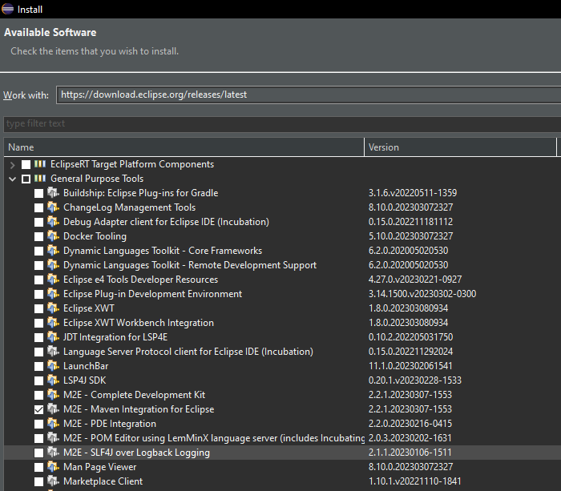

# Setting up the environment
Recently I have gone through the process of setting up the environment that allow for running simple Groovy scripts with the [Chemistry Development Kit](https://cdk.github.io/). The latter one contains a set of open source Java libraries for Cheminformatics. The simplest way of integrating in this library is through [Maven](https://maven.apache.org/). Let's go. 
## Eclipse
* Just download and install the Eclipse IDE for Java developers from [Here](https://www.eclipse.org/downloads/packages/). I used here the version 4.27.0.

## Java SDK
* I used here the Java SDK from [OpenJDK] (https://www.openlogic.com/openjdk-downloads), the version 17.0.6+ 10 for Windows.

## Maven in Eclipse
* In Eclipse click Open / Install New Software, the "Work with" field enter: https://download.eclipse.org/releases/latest. Choose General Purpose Tools / m2e - Maven Integration for Eclipse (see screen blow).

## Groovy in Eclipse